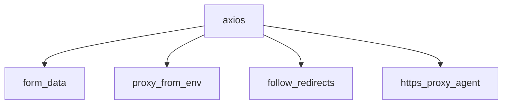

# DSH 插件使用指南

> 面向 DSH 使用者：本仓库两个插件怎么安装、调用、看结果。
> 插件开发/发布流程见 [发布流程.md](./发布流程.md)。

## 插件一览

| 插件 | 工具 | 一句话 |
|------|------|--------|
| `@cqpdrcuk/dsh-plugin-npm-advisor` | `npm_package_audit` / `npm_dependency_tree` | 装新 npm 包前，判断这个包是不是最优解 |
| `@cqpdrcuk/dsh-plugin-hardware-benchmark` | `hardware_benchmark` | 读本机硬件，开发/游戏双维打分 + 升级建议 |

---

## 一、安装

### 标准命令（有 dsh CLI 的环境）

```sh
# npm 包方式（推荐，已发布 0.1.0）
dsh plugin --profile web add @cqpdrcuk/dsh-plugin-npm-advisor
dsh plugin --profile web add @cqpdrcuk/dsh-plugin-hardware-benchmark

# 或 GitHub 源码方式（1024Store 收录的安装规格）
dsh plugin --profile web add github:ERVeepp/dsh-plugins#path:packages/tool-npm-advisor
dsh plugin --profile web add github:ERVeepp/dsh-plugins#path:packages/tool-hardware-benchmark
```

装完**重启 DSH**，插件随 bundle 激活。

### 桌面壳（deepseek-harness-desktop）环境

`dsh` 不在 PATH，用壳内完整路径 + DSH_HOME：

```powershell
$env:DSH_HOME = "$env:APPDATA\deepseek-harness-desktop\dsh-home"
& "$env:APPDATA\deepseek-harness-desktop\versions\<版本>\node_modules\.bin\dsh.CMD" plugin --profile web add @cqpdrcuk/dsh-plugin-npm-advisor
```

验证已激活：

```powershell
# 看 profile 的 bundles 是否包含两个包
Get-Content "$env:APPDATA\deepseek-harness-desktop\dsh-home\profiles\web\package.json" | ConvertFrom-Json | % { $_.dsh.profile.bundles }
```

卸载：

```sh
dsh plugin --profile web remove @cqpdrcuk/dsh-plugin-npm-advisor
```

---

## 二、插件 1：npm-advisor（装包前审查）

### 工具与参数

| 工具 | 参数 | 返回 |
|------|------|------|
| `npm_package_audit` | `packageName`（必填） | JSON：registry 元数据 + 原生替代/弃坑命中 |
| `npm_dependency_tree` | `packageName`；`depth`（默认 2） | mermaid 依赖图 |

### 调用示例（DSH UI 里直接说）

> "帮我看下我想装 axios 合不合适"

Agent 调 `npm_package_audit("axios")` → 返回：

```json
{
  "name": "axios",
  "latest": "1.19.0",
  "deprecated": null,
  "lastPublish": "1.19.0",
  "publishedCount": 200,
  "directDependencies": 4,
  "readmeHead": "# axios...",
  "nativeAlternative": "原生 fetch（Node 18+）",
  "deadPackage": null
}
```

Agent 会结合 `nativeAlternative` 告诉你："axios 的常规请求 Node 18+ 原生 `fetch` 就够，不需要引包"。

> "moment 还能用吗？"

返回会命中：

```json
{
  "deadPackage": "进入维护模式（官方 README 推荐 dayjs / date-fns / Luxon）",
  "nativeAlternative": "dayjs / date-fns / 原生 Temporal"
}
```

**原理**：插件给事实（registry 元数据 + 映射表 + README 头部迁移声明），最终选型由模型结合 README 裁决。

### 依赖树

> "axios 会带多少依赖？"

Agent 调 `npm_dependency_tree("axios", 1)` → mermaid：



---

## 三、插件 2：hardware-benchmark（硬件打分 + 升级建议）

### 工具与参数

| 工具 | 参数 | 返回 |
|------|------|------|
| `hardware_benchmark` | 无 | JSON：硬件画像 + dev/game/network 分 + 升级建议 |

### 调用示例

> "看下我这台电脑适不适合做开发 / 打游戏"

Agent 调 `hardware_benchmark` → 返回（节选）：

```json
{
  "hardware": { "cpuModel": "...", "totalMemGB": 16, "memType": "DDR4", "gpuModel": "...", "downloadMbps": 320 },
  "dev":   { "score": 72, "grade": "A", "reasons": ["..."] },
  "game":  { "score": 45, "grade": "C", "reasons": ["..."] },
  "network": { "score": 80, "grade": "A", "reasons": ["实测下载 320Mbps：主流水平"] },
  "overall": "开发主力机",
  "upgrades": [
    { "priority": "high", "costBand": "low", "part": "内存", "suggestion": "内存是'最便宜见效最快'的升级：DDR4 平台直接加条最划算（DDR4 升不了 DDR5）", "recommendation": "32GB DDR5（DDR4 主板升不了 DDR5，需整机换代）", "searchHint": "DDR5 32GB 2x16GB 6000MHz 价格" }
  ]
}
```

> "我想升级，帮我列个带价格的性价比清单"

Agent 调 `hardware_benchmark` 拿到 `upgrades`，再按 `searchHint` 调 `web_search` 实时查价，汇总成带参考价的升级清单（价格由模型实时查，插件不硬编码）。

**升级建议是 DIY 玩家口吻**：会提示兼容性（DDR4 升不了 DDR5、加显卡看电源瓦数/机箱长度、笔记本外接显卡坞性价比低）、按性价比排序（同优先级便宜的先列）。

### 已采集的硬件维度

CPU（核/线程/频率）、内存（容量/代数）、磁盘（类型/容量）、GPU（型号/显存）、网卡（类型/速率）、电池健康度 + Cloudflare 实测网速。

---

## 四、常见问题

- **插件装好后 UI 里没出现**：确认重启了 DSH；`hardware_benchmark` 是"无参数工具"，直接让 agent 调用即可，不需要界面按钮
- **`hardware_benchmark` 报某些指标 null**：该硬件项采集失败（虚拟机/无独显/断网），插件容错降级，不影响整体
- **价格是假的/过时？**：价格由 DSH 模型 `web_search` 实时查，若没联网就查不到；插件本身不硬编码价格
